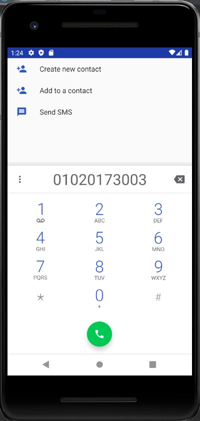

# 캡스톤디자인 주간 A반

## 1주차

## 2주차
  - 출석과제
  
</img>

## 3주차 과제

</img>

</img>

## 4주차 과제
  - 아이디어 명: 약속장소를 추천해주는 앱
  - 기획배경: 누구나 멀리 떨어져 사는 친구/지인들과 약속을 잡을 때 한 사람이 희생하여 먼 거리를 이동해야 했던 수고를 겪었던 경험이 있을 것이다. 이처럼 거리가 멀다 보니 약속장소 하나 정하는 것도 쉽지 않은데, 이 앱을 통하면 모두에게 중간지점이 되는 장소를 추천하고 그 곳 주변에 위치한 맛집, 카페, 놀거리 등을 소개함으로써 쉽고 간편하며 누구에게나 공정한 약속장소를 정할 수 있다.

## 5주차 과제

</img>

</img>

## 6주차 과제

</img>
</img>

</img>
</img>
